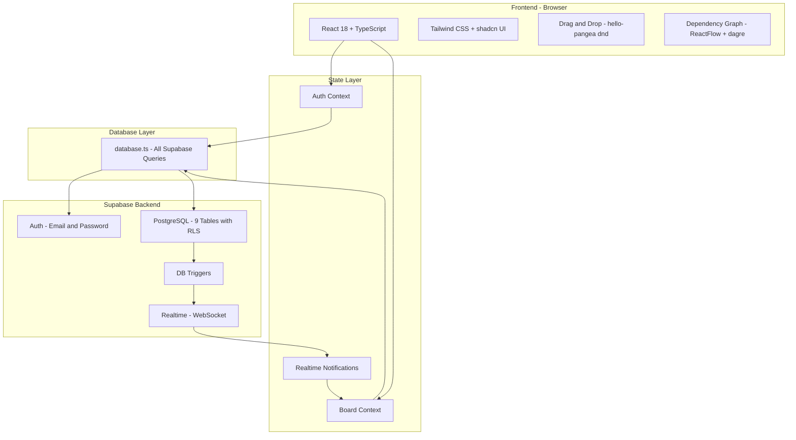
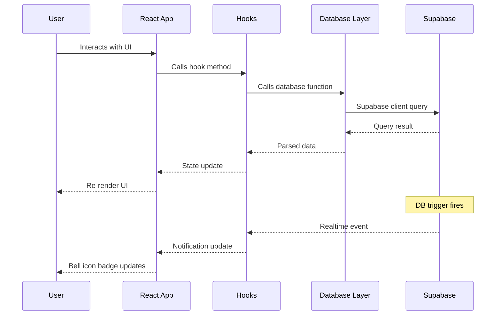
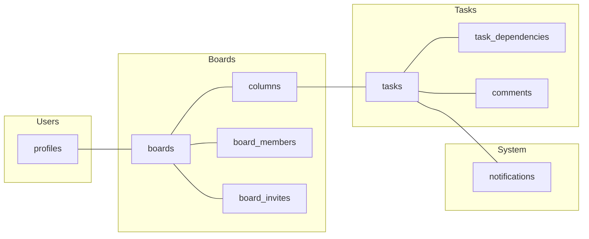

# TaskLink Architecture

---

## High-Level System Architecture



---

## Request Flow



---

## Tech Stack

| Layer | Technology | Purpose |
|-------|-----------|---------|
| UI | React 18 + TypeScript | Component-based SPA |
| Styling | Tailwind CSS + shadcn UI | Utility CSS and prebuilt components |
| Routing | react-router-dom v6 | Client-side navigation |
| Forms | react-hook-form + Zod | Validation |
| Drag and Drop | hello-pangea dnd | Kanban task reordering |
| Graph | ReactFlow + dagre | Dependency visualization |
| Auth | Supabase Auth | Email and password, JWT |
| Database | Supabase PostgreSQL | 9 tables with RLS |
| Realtime | Supabase Realtime | Live notifications |
| Build | Vite | Dev server and production builds |

---

## Database Tables



---

## Folder Structure

```
src/
├── pages/           Auth, Board, Dependencies, Profile, Team
├── components/      Kanban, Modals, Header, Cards
│   └── ui/          shadcn UI primitives
├── hooks/           useAuth, useBoard, useNotifications
├── lib/             Database queries and utilities
│   └── database/    Comments, Members, Notifications
├── types/           TypeScript interfaces
└── integrations/    Supabase client and generated types
```
