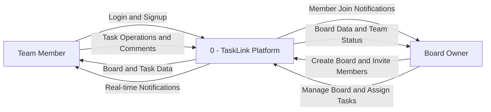
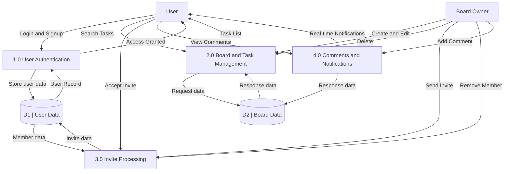

# TaskLink Data Flow Diagrams

---

## DFD Level 0 -- Context Diagram

---

## DFD Level 1

---

## Data Dictionary

| ID | Data Store | Tables |
|---|---|---|
| D1 | User Data | profiles, board_members, board_invites |
| D2 | Board Data | boards, columns, tasks, task_dependencies, comments, notifications |

## Process Summary

| Process | Description |
|---|---|
| 1.0 User Authentication | Handles signup, login, session management; auto-creates profile via DB trigger |
| 2.0 Board and Task Management | Board CRUD, task CRUD, drag-and-drop moves, search and filter, dependencies |
| 3.0 Invite Processing | Send invites by email, accept invites, remove members |
| 4.0 Comments and Notifications | Add and view comments on tasks; real-time notification delivery |
