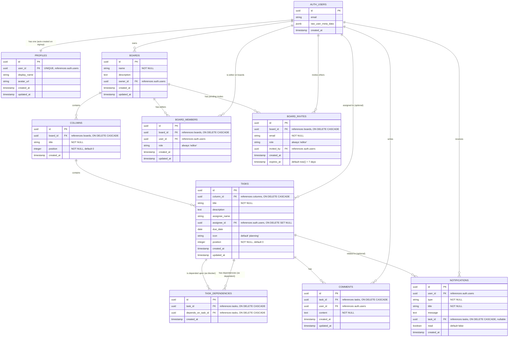
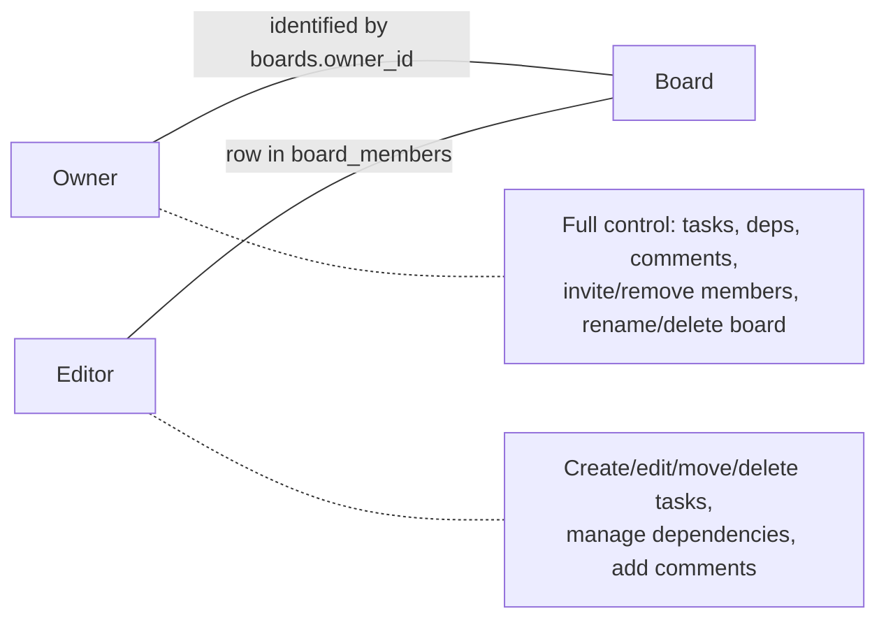

# TaskLink Entity-Relationship Diagram

## E-R Diagram (Mermaid)

---

## Entity Descriptions

### AUTH_USERS (Supabase managed)
The authentication table managed by Supabase Auth. Stores user credentials and metadata. All other user references point here via foreign keys.

### PROFILES
Extended user information auto-created via a database trigger (`handle_new_user`) when a user signs up. Stores display name and avatar URL. One-to-one relationship with `auth.users`.

### BOARDS
Project boards that serve as the top-level organizational unit. Each board is owned by one user (tracked via `owner_id`). The owner has full control including inviting/removing members and deleting the board. Deleting a board cascades to all its columns, tasks, dependencies, comments, members, and invites.

### COLUMNS
Kanban columns within a board. Every new board starts with three default columns: **To Do** (position 0), **In Progress** (position 1), **Done** (position 2). Ordered by `position`.

### TASKS
Individual task cards within columns. Each task belongs to exactly one column and has a title, optional description, optional assignee (both name and user reference), optional due date, a category icon, and a position for ordering within the column. Cascade-deleted when the parent column is deleted.

### TASK_DEPENDENCIES
Many-to-many self-referencing relationship on tasks. Represents "Task A depends on Task B" (i.e., Task A is blocked by Task B). Has a unique constraint on `(task_id, depends_on_task_id)` and a check constraint preventing self-references (`task_id != depends_on_task_id`).

### COMMENTS
Discussion thread on tasks. Each comment is tied to a task and the user who wrote it. Comments are cascade-deleted when the parent task is removed.

### NOTIFICATIONS
System-generated alerts for users. Types include: `task_created`, `task_moved`, `task_unblocked`, `comment`, `member_joined`. Created by database triggers, delivered in real-time via Supabase Realtime subscriptions.

### BOARD_MEMBERS
Join table for board collaboration. Links a user to a board as an **editor**. All invited members get the same editor role -- there is no role hierarchy in this table. The board owner is identified separately via `boards.owner_id`. Unique constraint on `(board_id, user_id)`.

### BOARD_INVITES
Pending invitations to join a board. Stores the invitee's email (not user ID, since they may not have signed up yet), the role (always `editor`), who sent the invite, and a 7-day expiry timestamp. Unique constraint on `(board_id, email)`. Accepted via the `accept_board_invite` RPC function which atomically creates a `board_members` row and deletes the invite.

---

## Constraints & Triggers Summary

| Constraint / Trigger | Table | Description |
|---|---|---|
| `UNIQUE(user_id)` | profiles | One profile per auth user |
| `UNIQUE(board_id, user_id)` | board_members | User can only be a member once per board |
| `UNIQUE(board_id, email)` | board_invites | One active invite per email per board |
| `UNIQUE(task_id, depends_on_task_id)` | task_dependencies | No duplicate dependencies |
| `CHECK(task_id != depends_on_task_id)` | task_dependencies | No self-references |
| `ON DELETE CASCADE` | columns, tasks, task_dependencies, comments, notifications, board_members, board_invites | Parent deletion cascades to children |
| `ON DELETE SET NULL` | tasks.assignee_id | User deletion unassigns but keeps task |
| `handle_new_user()` | auth.users (trigger) | Auto-creates profile on signup |
| `update_updated_at_column()` | profiles, boards, tasks, comments, board_members (trigger) | Keeps updated_at current |
| `notify_task_update()` | tasks (trigger) | Fires task_created / task_moved notifications |
| `notify_comment()` | comments (trigger) | Fires comment notification to board owner |
| `notify_member_joined()` | board_members (trigger) | Fires member_joined notification to board owner |
| `notify_task_unblocked()` | tasks (trigger) | Fires task_unblocked when a task moves to Done |
| `notify_dependency_removed_unblock()` | task_dependencies (trigger) | Fires task_unblocked when a dependency is deleted |

---

## Access Model

- **Owner**: The board creator. Identified by `boards.owner_id`. Has full control over the board including inviting members, removing members, renaming, and deleting the board.
- **Editor**: All invited members. Stored in `board_members` with `role = 'editor'`. Can create, edit, move, and delete tasks; manage dependencies; and add comments.

RLS is enforced via helper functions:
- `has_board_access(board_id, user_id, min_role)` -- checks if user has at least the given role
- `can_edit_board(board_id, user_id)` -- shortcut for editor access
