# TaskLink User Flows

Detailed user flows for every feature in TaskLink, with Mermaid diagrams.

---

## 1. Authentication

### Sign Up

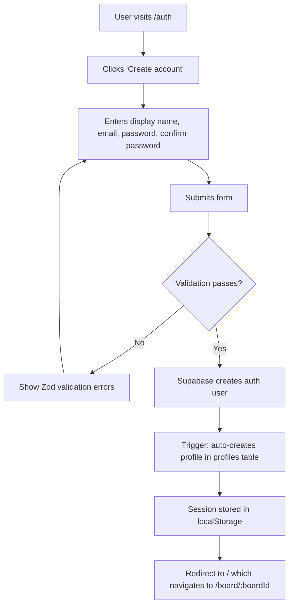

### Sign In

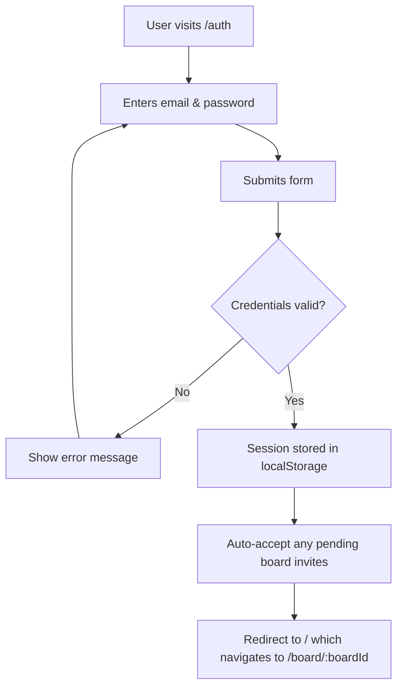

### Sign Out

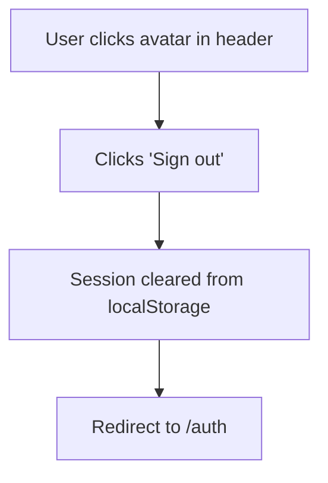

### Route Protection

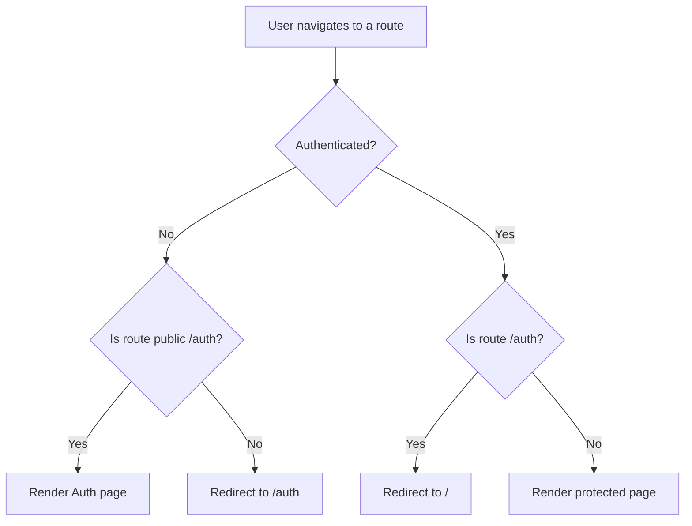

---

## 2. Board Management

### First-Time User / Default Board

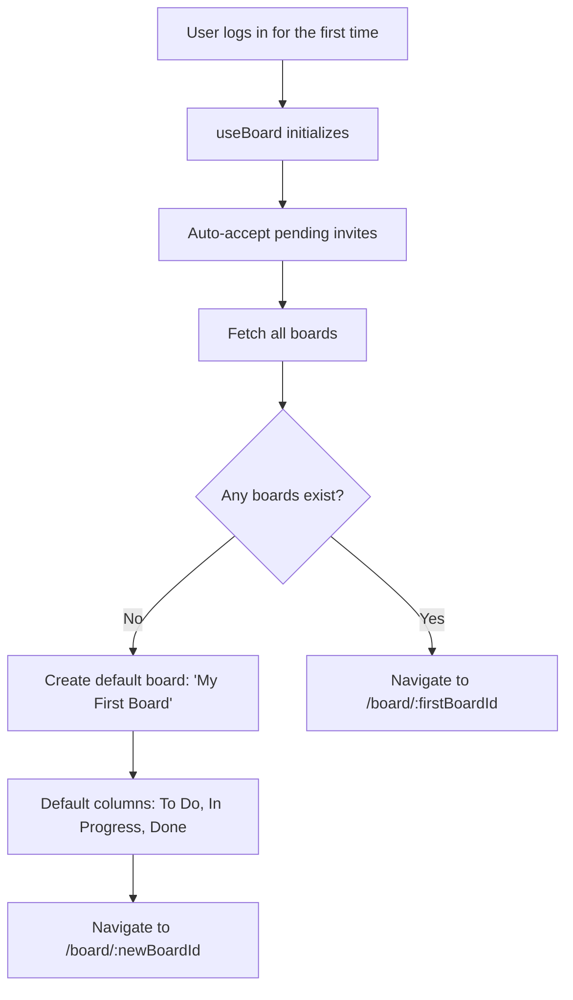

### Create a Board

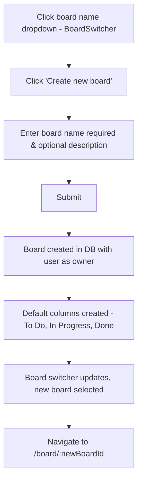

### Switch Boards

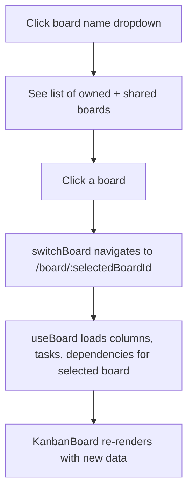

### Rename a Board

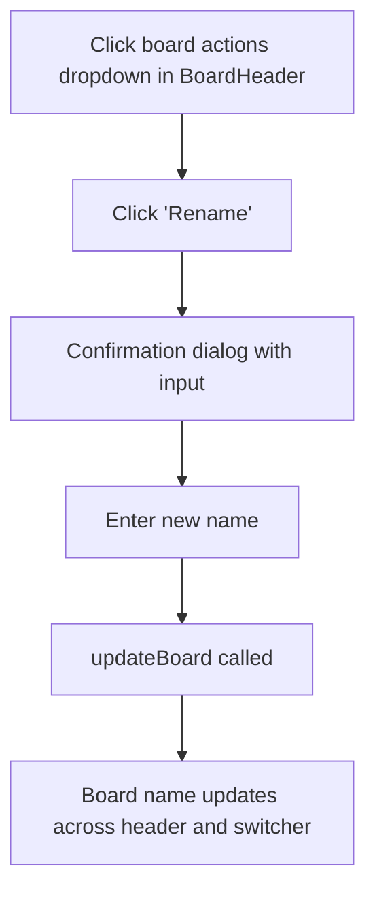

### Delete a Board

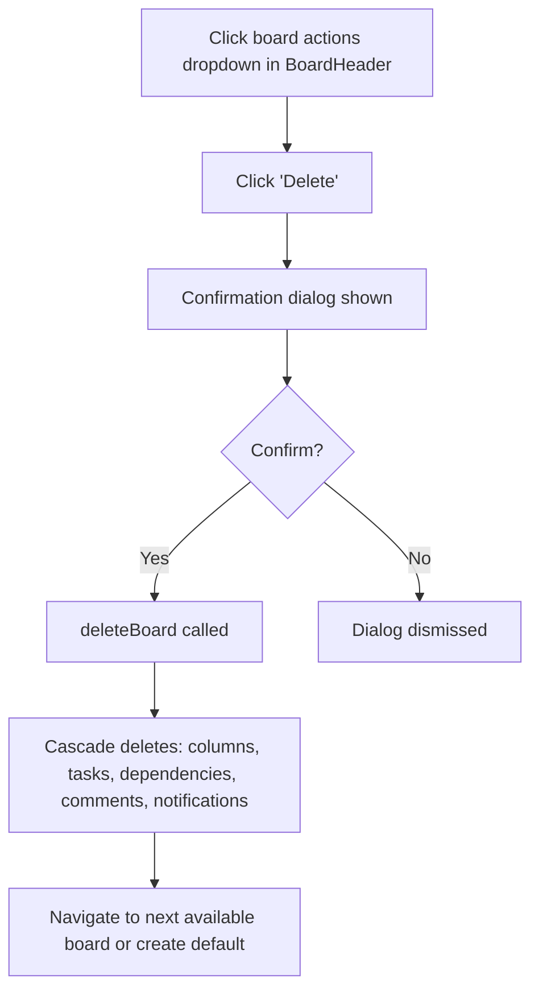

---

## 3. Task Management

### Create a Task

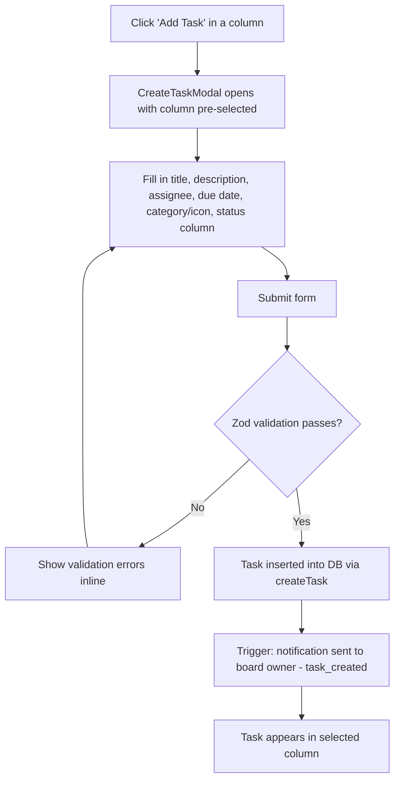

### Move a Task - Drag & Drop

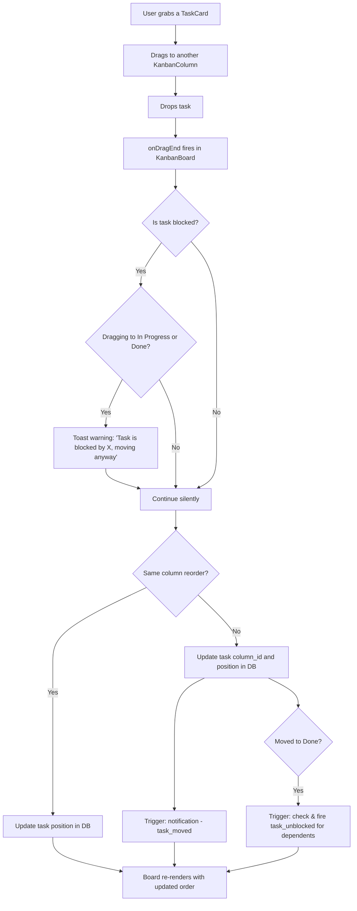

### Edit a Task

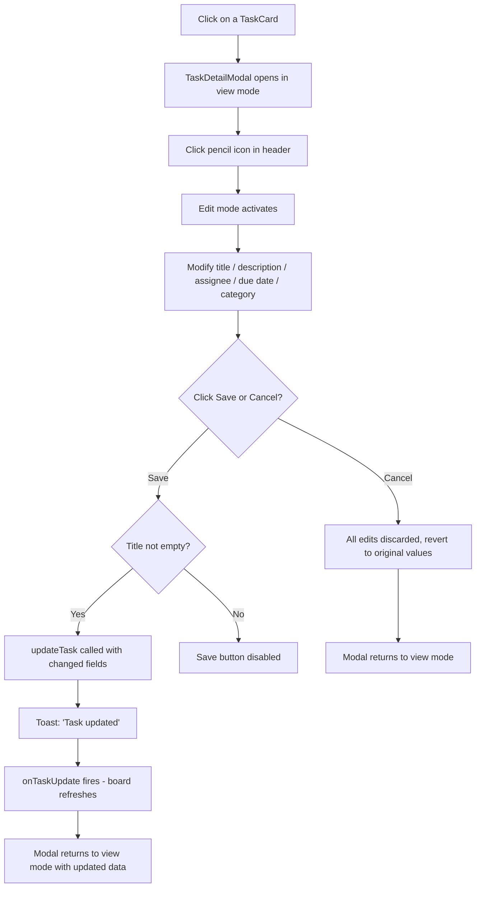

### Delete a Task

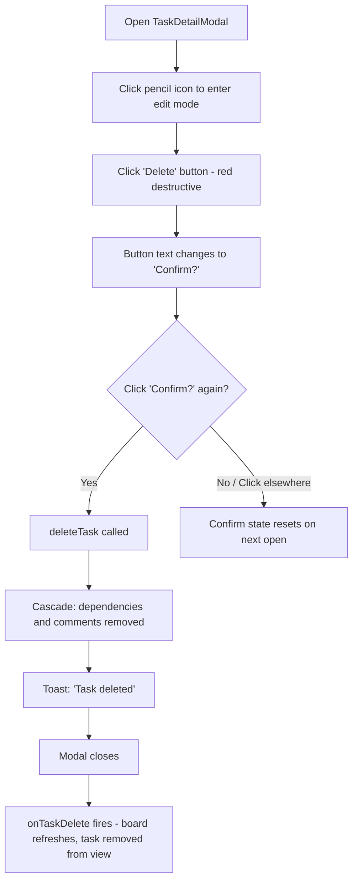

### Task Card Display

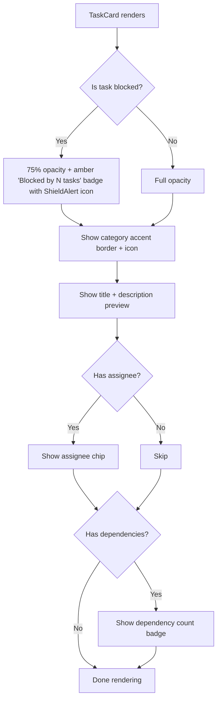

---

## 4. Task Dependencies

### Add a Dependency

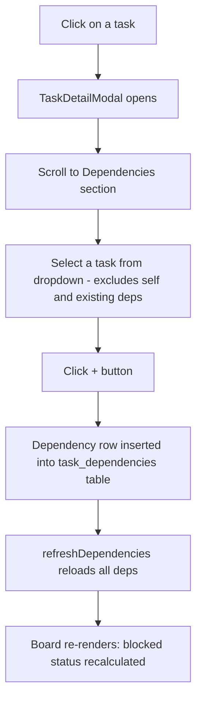

### Remove a Dependency

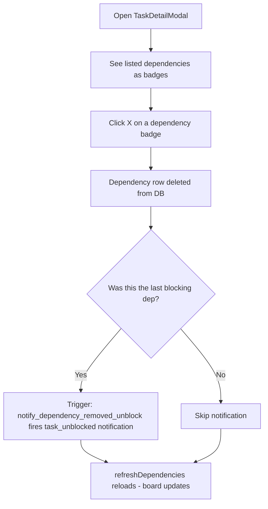

### Dependency Flow View

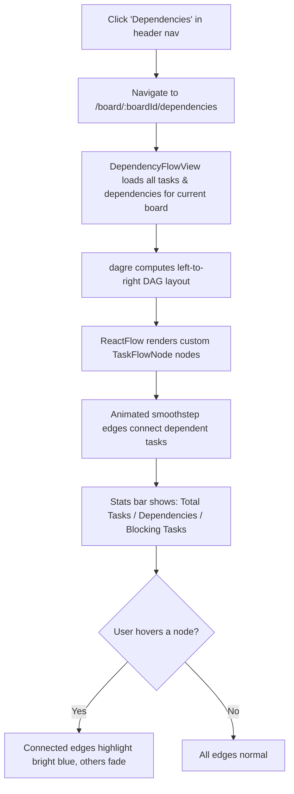

---

## 5. Comments

### Add a Comment

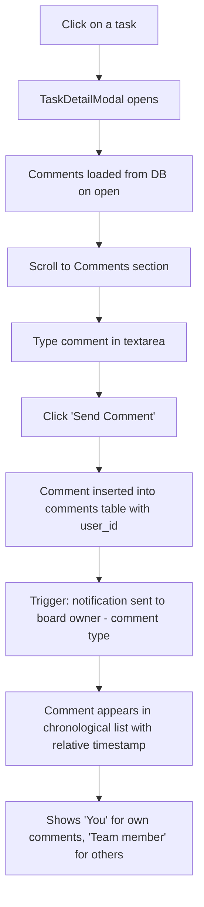

---

## 6. Notifications

### Notification Triggers

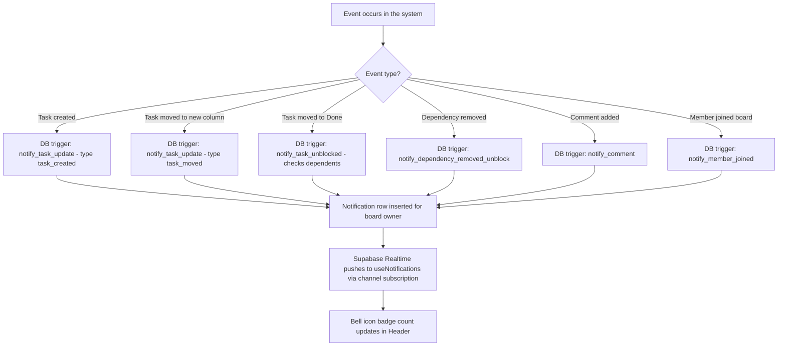

### Viewing & Clearing Notifications

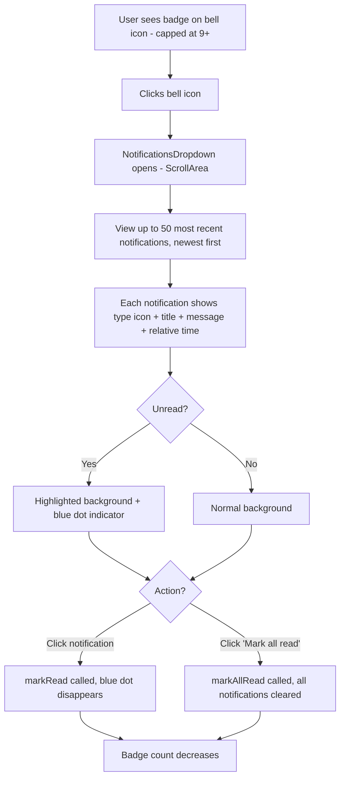

---

## 7. Team Collaboration

### Invite a Member (Owner)

```mermaid
flowchart TD
    A[Click + button next to team avatars in BoardHeader] --> B[TeamManagementModal opens]
    B --> C[Enter teammate's email]
    C --> D[Click invite button]
    D --> E[Invite row created in board_invites with role = editor]
    E --> F[Invite expires in 7 days]
    F --> G[Invite appears in pending invites list]
```

### Accept an Invitation (Invited User)

```mermaid
flowchart TD
    A[Invited user signs up / logs in] --> B{Auto-accept on login?}
    B -- Yes --> C[useBoard auto-accepts pending invites on initialization]
    C --> D[board_members row created with role = editor]
    D --> E[Board appears in board list immediately]
    B -- No / Manual --> F[Header shows mail icon with badge count]
    F --> G[Click mail icon]
    G --> H[PendingInvitesModal opens]
    H --> I[See board name, description, expiry]
    I --> J{Accept or let expire?}
    J -- Accept --> K[accept_board_invite RPC called]
    K --> L[board_members row created with role = editor]
    L --> M[Invite deleted from board_invites]
    M --> N[Trigger: notification to board owner - member_joined]
    N --> O[Shared board appears in user's board list]
    J -- Ignore --> P[Invite expires after 7 days and becomes invalid]
```

### Cancel an Invite (Owner)

```mermaid
flowchart TD
    A[Open TeamManagementModal] --> B[See list of pending invites]
    B --> C[Click cancel on an invite]
    C --> D[Invite deleted from board_invites]
    D --> E[Invite no longer appears in invited user's pending list]
```

### Manage Members (Owner)

```mermaid
flowchart TD
    A[Open TeamManagementModal or navigate to /board/:boardId/team] --> B[See list of current editors]
    B --> C{Action?}
    C -- Remove member --> D[Click remove button]
    D --> E[removeBoardMember called]
    E --> F[Member loses access to board immediately]
```

---

## 8. Access Control

### Two-Level Access Model

```mermaid
flowchart TD
    A[User interacts with a board] --> B{Is user the board owner?}
    B -- Yes --> C[Full access: all task ops + invite/remove members + rename/delete board]
    B -- No --> D{Is user in board_members?}
    D -- Yes --> E[Editor access: create/edit/move/delete tasks, dependencies, comments]
    D -- No --> F[No access - RLS blocks all queries]
```

### How Ownership Works

```mermaid
flowchart TD
    A[Board created] --> B[boards.owner_id = creator's user ID]
    B --> C[Owner identified by boards.owner_id - not board_members]
    C --> D[Owner can: invite, remove members, rename, delete board]

    E[User invited by email] --> F[accept_board_invite RPC runs]
    F --> G[board_members row created with role = editor]
    G --> H[Editor can: full task CRUD, deps, comments, drag and drop]
```

---

## 9. Search & Filter

### Search Tasks

```mermaid
flowchart TD
    A[User types in search input in Header] --> B[searchQuery state updates in BoardContext]
    B --> C[KanbanBoard filteredTasks useMemo recalculates]
    C --> D[Tasks filtered by title OR description - case insensitive]
    D --> E[Board re-renders showing only matching tasks across all columns]
```

### Filter Tasks

```mermaid
flowchart TD
    A[Click Filter button in BoardHeader] --> B[Filter popover opens]
    B --> C{Select filter type}
    C -- Assignee --> D[Choose: All / Unassigned / Specific member name]
    C -- Status --> E[Choose a column: To Do / In Progress / Done]
    D --> F[filterAssignee state updates in BoardContext]
    E --> G[filterStatus state updates in BoardContext]
    F --> H[KanbanBoard filteredTasks recalculates]
    G --> H
    H --> I[Active filter count badge shown on Filter button]
    I --> J[Active filter pills displayed inline]
    J --> K{Click X on a pill?}
    K -- Yes --> L[That filter cleared, tasks re-filtered]
    K -- No --> M[Filters remain active]
```

---

## 10. Profile Management

### View & Edit Profile

```mermaid
flowchart TD
    A[Click avatar in Header] --> B[Click 'Profile']
    B --> C[Navigate to /profile]
    C --> D[Profile page loads: avatar initials, display name, email]
    D --> E{Click 'Edit Profile'?}
    E -- Yes --> F[Display name input becomes editable]
    F --> G[Enter new name - Zod validated: 2-50 chars]
    G --> H[Click 'Save Changes']
    H --> I[Updates auth.users metadata AND profiles table]
    I --> J[Toast: 'Profile updated']
    J --> K[Profile page reflects new name]
    E -- No --> L[View only]
```

---

## 11. End-to-End Flow: New User Joins a Team

```mermaid
sequenceDiagram
    actor Owner as Board Owner
    actor User as New User
    participant App as TaskLink
    participant DB as Supabase

    Owner->>App: Open TeamManagementModal
    Owner->>App: Enter User's email
    Owner->>App: Click invite
    App->>DB: Insert into board_invites (role=editor, expires in 7 days)

    User->>App: Sign up at /auth
    App->>DB: Create auth user
    DB->>DB: Trigger: create profile in profiles table

    User->>App: Redirect to / after login
    App->>DB: useBoard init: auto-accept pending invites
    DB->>DB: accept_board_invite RPC runs
    DB->>DB: Insert board_member (role: editor)
    DB->>DB: Delete invite
    DB->>DB: Trigger: notify owner - member_joined

    App->>DB: Fetch all boards (owned + shared)
    App-->>User: Shared board now visible in board switcher

    User->>App: Select shared board
    User->>App: Create tasks, edit tasks, drag & drop (editor permissions)
    User->>App: Add comments on tasks
    DB->>DB: Trigger: notify owner - comment added
    Owner->>App: Bell icon shows new notification
```

---

## 12. End-to-End Flow: Task Lifecycle

```mermaid
sequenceDiagram
    actor User as Team Member
    participant Board as Kanban Board
    participant Modal as TaskDetailModal
    participant DB as Supabase

    User->>Board: Click 'Add Task' on To Do column
    Board->>Modal: CreateTaskModal opens (column pre-selected)
    User->>Modal: Fill title, description, assignee, due date, category
    User->>Modal: Submit
    Modal->>DB: createTask()
    DB->>DB: Trigger: task_created notification to owner
    DB-->>Board: Task appears in To Do

    User->>Board: Drag task from To Do to In Progress
    Board->>DB: moveTask(taskId, inProgressColumnId, position)
    DB->>DB: Trigger: task_moved notification

    User->>Board: Click task to open details
    Board->>Modal: TaskDetailModal opens (view mode)
    User->>Modal: Click pencil icon to edit
    User->>Modal: Update description and assignee
    User->>Modal: Click Save
    Modal->>DB: updateTask()
    DB-->>Board: Board refreshes with updated task

    User->>Board: Drag task from In Progress to Done
    Board->>DB: moveTask(taskId, doneColumnId, position)
    DB->>DB: Trigger: task_moved notification
    DB->>DB: Trigger: check dependents - fire task_unblocked if applicable
    DB-->>Board: Dependent tasks unblocked (amber badge removed)
```
