# TaskLink User Flows

Detailed user flows for every feature in TaskLink, with Mermaid diagrams.

---

## 1. Authentication

### Sign Up

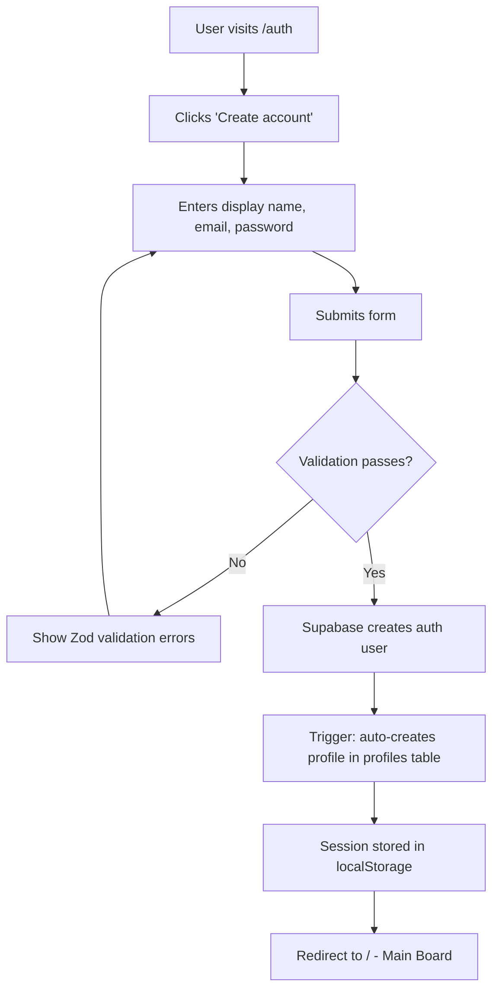
```mermaid
flowchart TD
    A[User visits /auth] --> B[Clicks 'Create account']
    B --> C[Enters display name, email, password]
    C --> D[Submits form]
    D --> E{Validation passes?}
    E -- No --> F[Show Zod validation errors]
    F --> C
    E -- Yes --> G[Supabase creates auth user]
    G --> H[Trigger: auto-creates profile in profiles table]
    H --> I[Session stored in localStorage]
    I --> J[Redirect to / - Main Board]
```

### Sign In

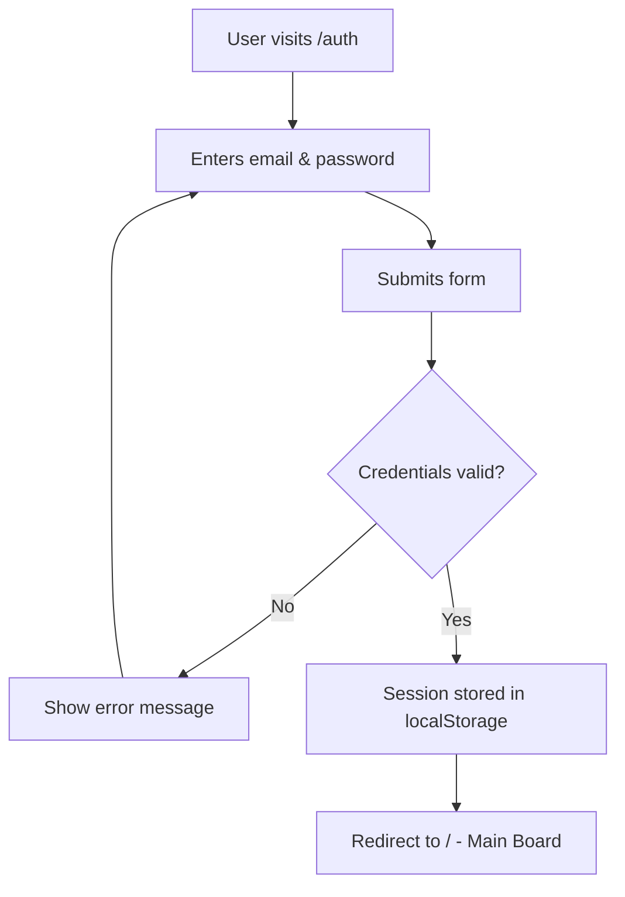
```mermaid
flowchart TD
    A[User visits /auth] --> B[Enters email & password]
    B --> C[Submits form]
    C --> D{Credentials valid?}
    D -- No --> E[Show error message]
    E --> B
    D -- Yes --> F[Session stored in localStorage]
    F --> G[Redirect to / - Main Board]
```

### Sign Out

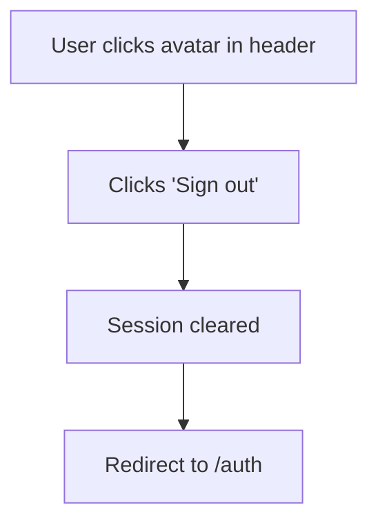
```mermaid
flowchart TD
    A[User clicks avatar in header] --> B[Clicks 'Sign out']
    B --> C[Session cleared]
    C --> D[Redirect to /auth]
```

### Route Protection

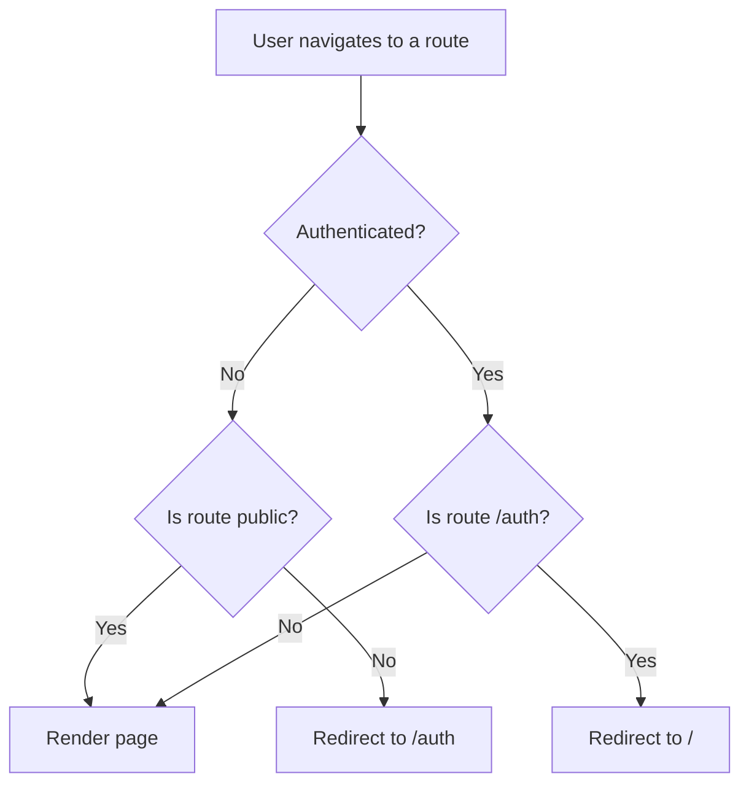
```mermaid
flowchart TD
    A[User navigates to a route] --> B{Authenticated?}
    B -- No --> C{Is route public?}
    C -- Yes --> D[Render page]
    C -- No --> E[Redirect to /auth]
    B -- Yes --> F{Is route /auth?}
    F -- Yes --> G[Redirect to /]
    F -- No --> D
```

---

## 2. Board Management

### Create a Board

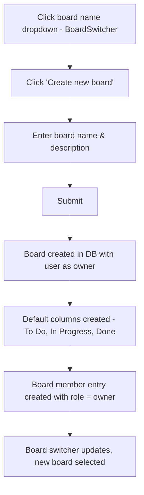
```mermaid
flowchart TD
    A[Click board name dropdown - BoardSwitcher] --> B[Click 'Create new board']
    B --> C[Enter board name & description]
    C --> D[Submit]
    D --> E[Board created in DB with user as owner]
    E --> F[Default columns created - To Do, In Progress, Done]
    F --> G[Board member entry created with role = owner]
    G --> H[Board switcher updates, new board selected]
```

### Switch Boards

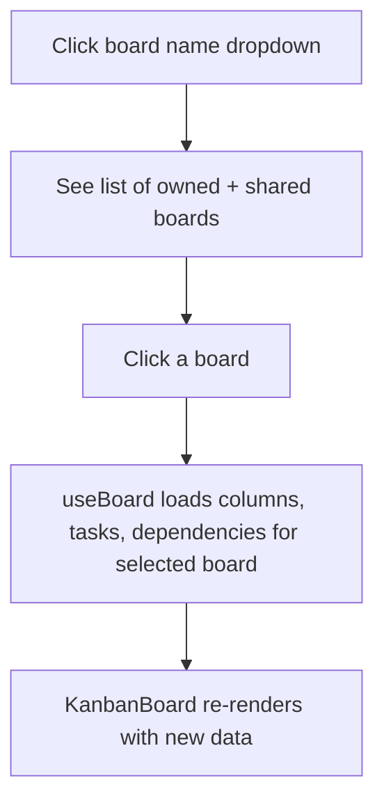
```mermaid
flowchart TD
    A[Click board name dropdown] --> B[See list of owned + shared boards]
    B --> C[Click a board]
    C --> D[useBoard loads columns, tasks, dependencies for selected board]
    D --> E[KanbanBoard re-renders with new data]
```

---

## 3. Task Management

### Create a Task

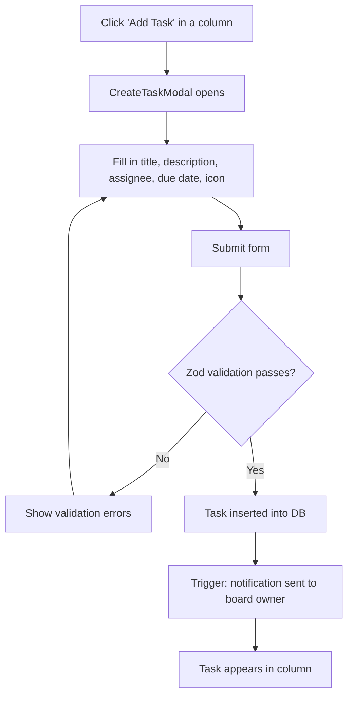
```mermaid
flowchart TD
    A[Click 'Add Task' in a column] --> B[CreateTaskModal opens]
    B --> C[Fill in title, description, assignee, due date, icon]
    C --> D[Submit form]
    D --> E{Zod validation passes?}
    E -- No --> F[Show validation errors]
    F --> C
    E -- Yes --> G[Task inserted into DB]
    G --> H[Trigger: notification sent to board owner]
    H --> I[Task appears in column]
```

### Move a Task (Drag & Drop)

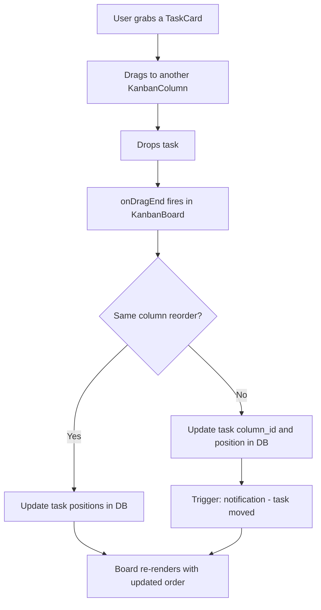
```mermaid
flowchart TD
    A[User grabs a TaskCard] --> B[Drags to another KanbanColumn]
    B --> C[Drops task]
    C --> D[onDragEnd fires in KanbanBoard]
    D --> E{Same column reorder?}
    E -- Yes --> F[Update task positions in DB]
    E -- No --> G[Update task column_id and position in DB]
    G --> H[Trigger: notification - task moved]
    F --> I[Board re-renders with updated order]
    H --> I
```

### View & Edit Task Details

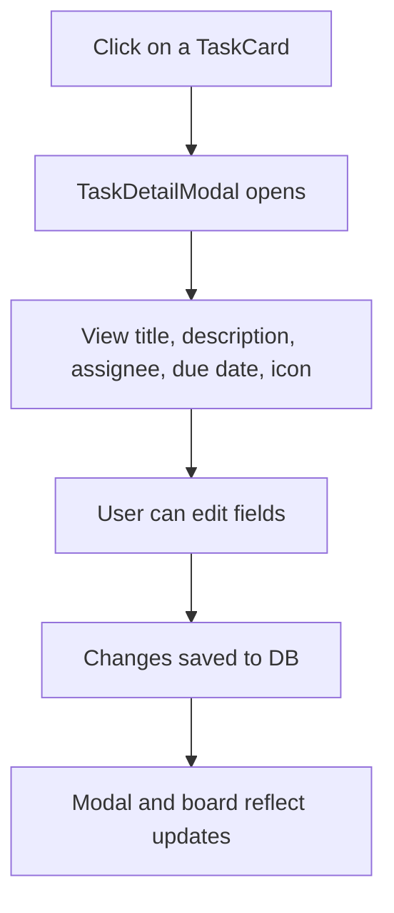
```mermaid
flowchart TD
    A[Click on a TaskCard] --> B[TaskDetailModal opens]
    B --> C[View title, description, assignee, due date, icon]
    C --> D[User can edit fields]
    D --> E[Changes saved to DB]
    E --> F[Modal and board reflect updates]
```

---

## 4. Task Dependencies

### Add a Dependency

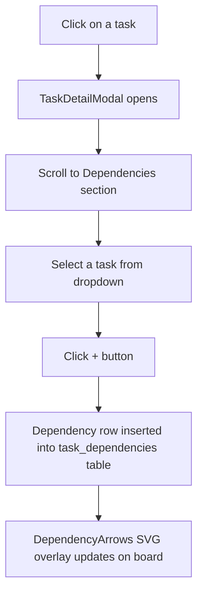
```mermaid
flowchart TD
    A[Click on a task] --> B[TaskDetailModal opens]
    B --> C[Scroll to Dependencies section]
    C --> D[Select a task from dropdown]
    D --> E[Click + button]
    E --> F[Dependency row inserted into task_dependencies table]
    F --> G[DependencyArrows SVG overlay updates on board]
```

### Remove a Dependency

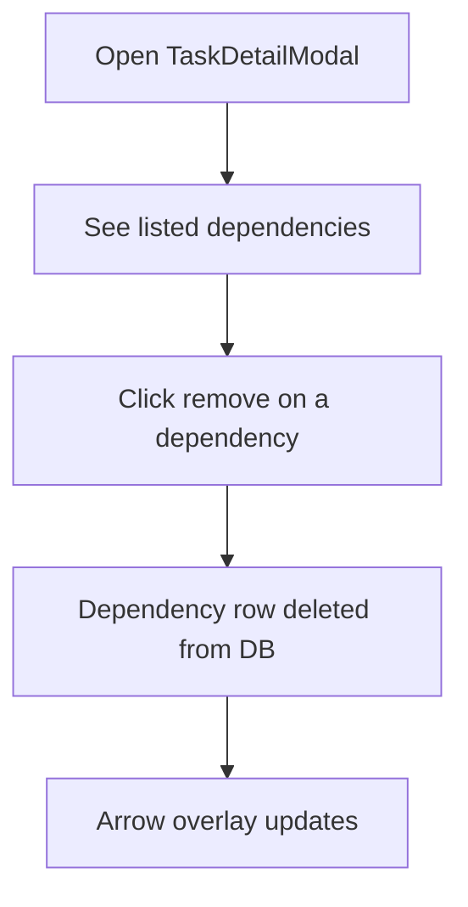
```mermaid
flowchart TD
    A[Open TaskDetailModal] --> B[See listed dependencies]
    B --> C[Click remove on a dependency]
    C --> D[Dependency row deleted from DB]
    D --> E[Arrow overlay updates]
```

### Dependency Flow View

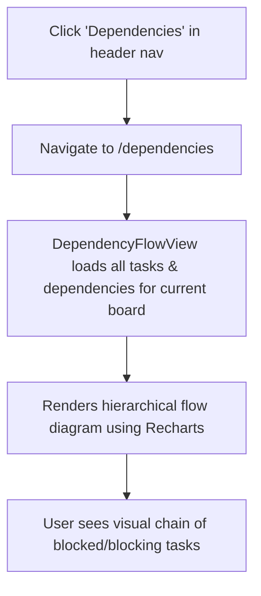
```mermaid
flowchart TD
    A[Click 'Dependencies' in header nav] --> B[Navigate to /dependencies]
    B --> C[DependencyFlowView loads all tasks & dependencies for current board]
    C --> D[Renders hierarchical flow diagram using Recharts]
    D --> E[User sees visual chain of blocked/blocking tasks]
```

---

## 5. Comments

### Add a Comment

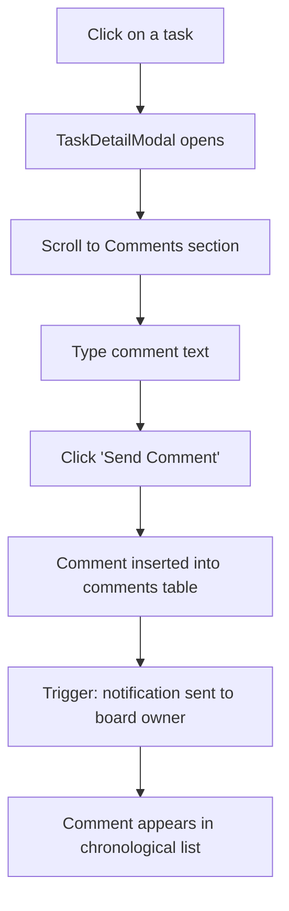
```mermaid
flowchart TD
    A[Click on a task] --> B[TaskDetailModal opens]
    B --> C[Scroll to Comments section]
    C --> D[Type comment text]
    D --> E[Click 'Send Comment']
    E --> F[Comment inserted into comments table]
    F --> G[Trigger: notification sent to board owner]
    G --> H[Comment appears in chronological list]
```

---

## 6. Notifications

### Notification Lifecycle

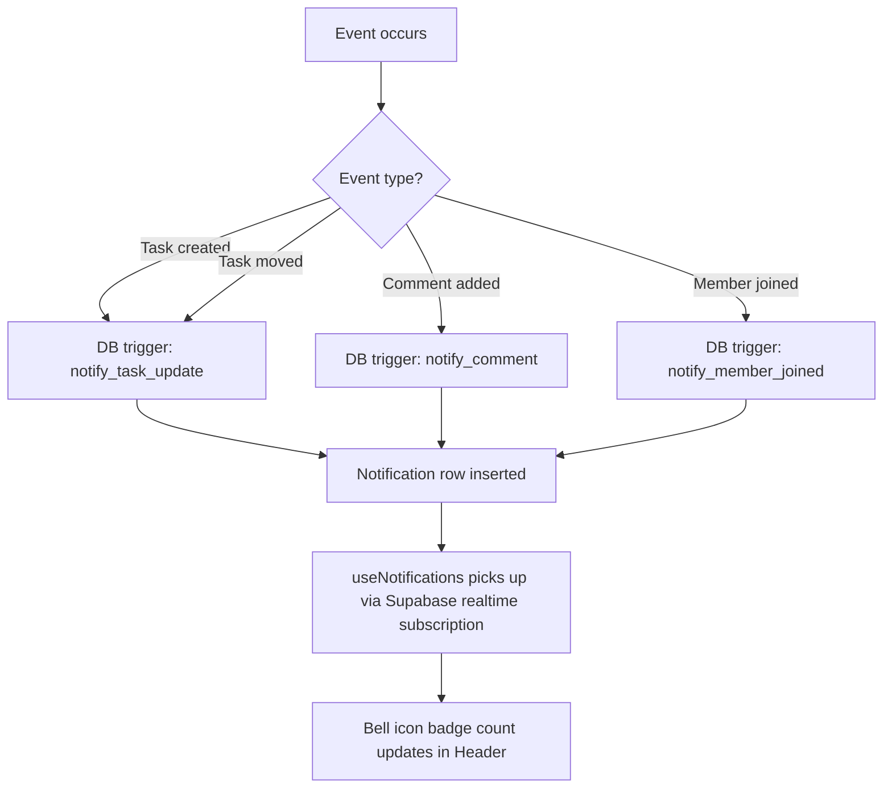
```mermaid
flowchart TD
    A[Event occurs] --> B{Event type?}
    B -- Task created --> C[DB trigger: notify_task_update]
    B -- Task moved --> C
    B -- Comment added --> D[DB trigger: notify_comment]
    B -- Member joined --> E[DB trigger: notify_member_joined]
    C --> F[Notification row inserted]
    D --> F
    E --> F
    F --> G[useNotifications picks up via Supabase realtime subscription]
    G --> H[Bell icon badge count updates in Header]
```

### Viewing & Clearing Notifications

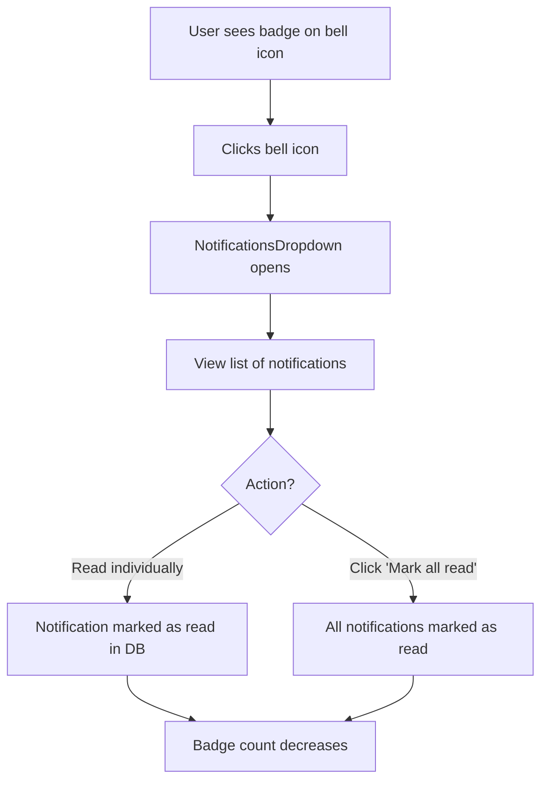
```mermaid
flowchart TD
    A[User sees badge on bell icon] --> B[Clicks bell icon]
    B --> C[NotificationsDropdown opens]
    C --> D[View list of notifications]
    D --> E{Action?}
    E -- Read individually --> F[Notification marked as read in DB]
    E -- Click 'Mark all read' --> G[All notifications marked as read]
    F --> H[Badge count decreases]
    G --> H
```

---

## 7. Team Collaboration

### Invite a Member (Owner/Admin)

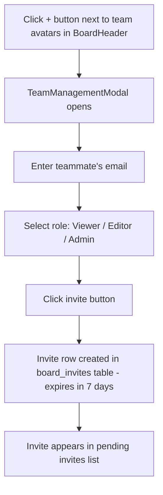
```mermaid
flowchart TD
    A[Click + button next to team avatars in BoardHeader] --> B[TeamManagementModal opens]
    B --> C[Enter teammate's email]
    C --> D[Select role: Viewer / Editor / Admin]
    D --> E[Click invite button]
    E --> F[Invite row created in board_invites table - expires in 7 days]
    F --> G[Invite appears in pending invites list]
```

### Accept an Invitation (Invited User)

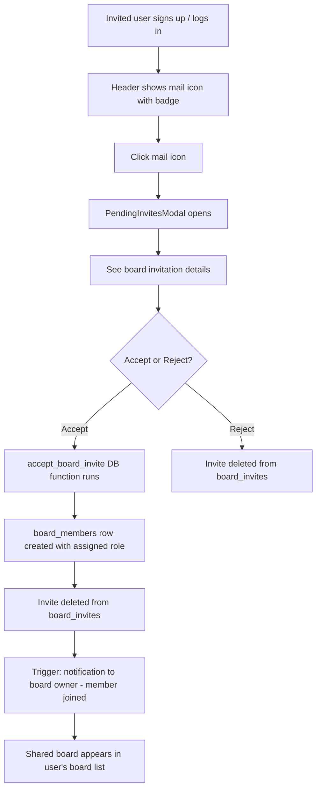
```mermaid
flowchart TD
    A[Invited user signs up / logs in] --> B[Header shows mail icon with badge]
    B --> C[Click mail icon]
    C --> D[PendingInvitesModal opens]
    D --> E[See board invitation details]
    E --> F{Accept or Reject?}
    F -- Accept --> G[accept_board_invite DB function runs]
    G --> H[board_members row created with assigned role]
    H --> I[Invite deleted from board_invites]
    I --> J[Trigger: notification to board owner - member joined]
    J --> K[Shared board appears in user's board list]
    F -- Reject --> L[Invite deleted from board_invites]
```

### Manage Members (Admin/Owner)

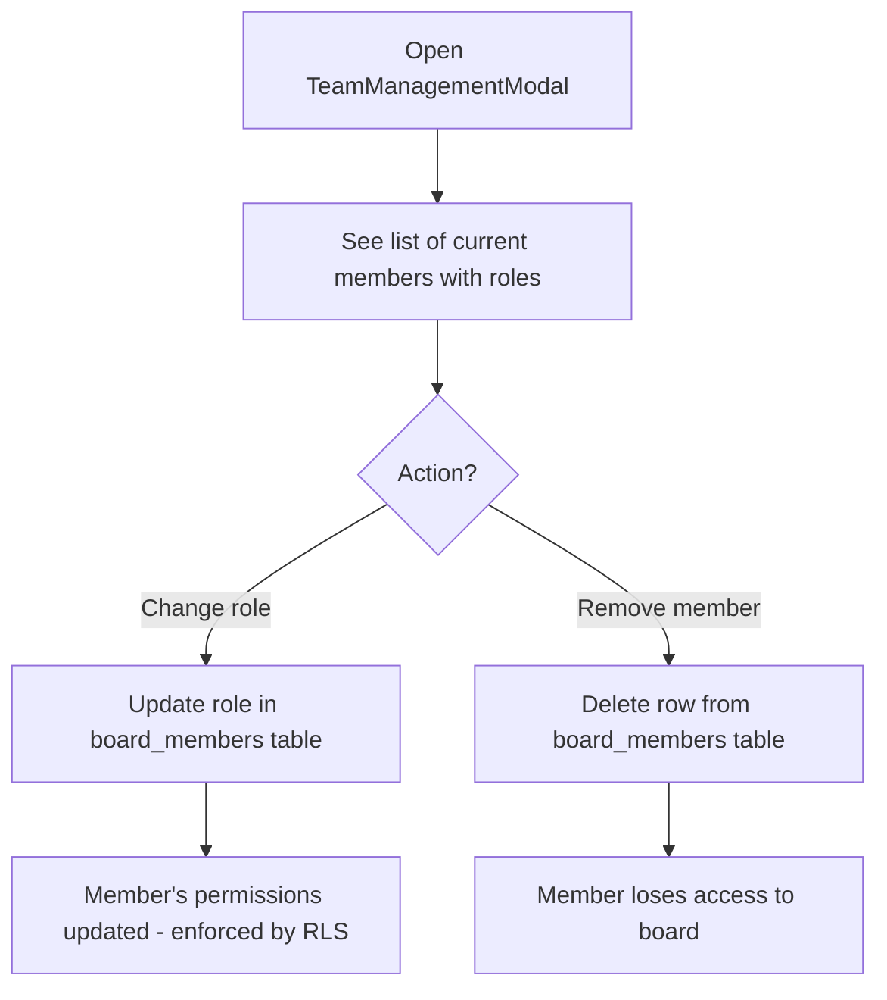
```mermaid
flowchart TD
    A[Open TeamManagementModal] --> B[See list of current members with roles]
    B --> C{Action?}
    C -- Change role --> D[Update role in board_members table]
    C -- Remove member --> E[Delete row from board_members table]
    D --> F[Member's permissions updated - enforced by RLS]
    E --> G[Member loses access to board]
```

---

## 8. Role-Based Access Control

### Permission Check Flow

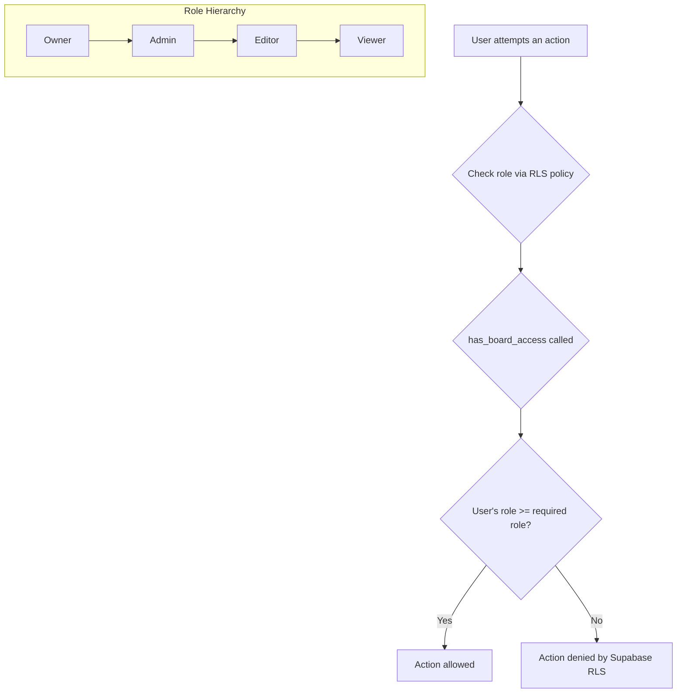
```mermaid
flowchart TD
    A[User attempts an action] --> B{Check role via RLS policy}
    B --> C{has_board_access called}
    C --> D{User's role >= required role?}
    D -- Yes --> E[Action allowed]
    D -- No --> F[Action denied by Supabase RLS]

    subgraph Role Hierarchy
        G[Owner] --> H[Admin]
        H --> I[Editor]
        I --> J[Viewer]
    end
```

### Frontend Permission Gating

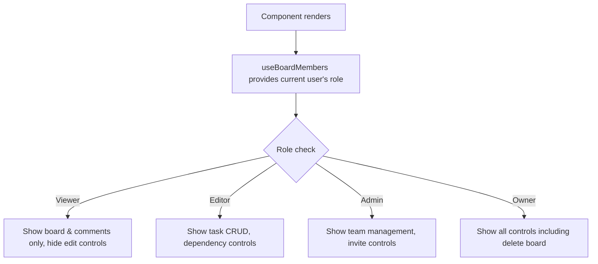
```mermaid
flowchart TD
    A[Component renders] --> B[useBoardMembers provides current user's role]
    B --> C{Role check}
    C -- Viewer --> D[Show board & comments only, hide edit controls]
    C -- Editor --> E[Show task CRUD, dependency controls]
    C -- Admin --> F[Show team management, invite controls]
    C -- Owner --> G[Show all controls including delete board]
```

---

## 9. End-to-End Flow: New User Joins a Team

```mermaid
sequenceDiagram
    actor Owner as Board Owner
    actor User as New User
    participant App as TaskLink
    participant DB as Supabase

    Owner->>App: Open TeamManagementModal
    Owner->>App: Enter User's email, select "Editor" role
    Owner->>App: Click invite
    App->>DB: Insert into board_invites

    User->>App: Sign up at /auth
    App->>DB: Create auth user
    DB->>DB: Trigger: create profile

    User->>App: See mail icon badge in header
    User->>App: Click mail icon
    App->>DB: Fetch pending invites for user's email
    App-->>User: Show invitation

    User->>App: Click "Accept"
    App->>DB: Call accept_board_invite()
    DB->>DB: Insert board_member (role: editor)
    DB->>DB: Delete invite
    DB->>DB: Trigger: notify owner - member joined

    User->>App: Open board switcher
    App->>DB: Fetch boards (owned + shared)
    App-->>User: Shared board now visible
    User->>App: Select shared board
    User->>App: Create tasks, drag & drop (editor permissions)
